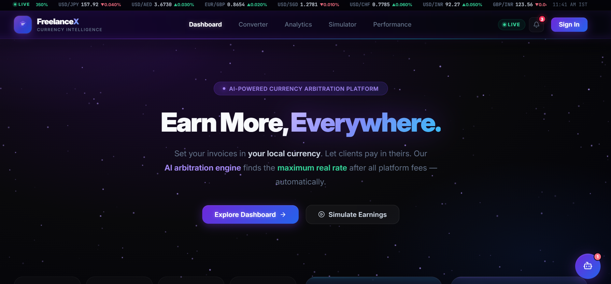
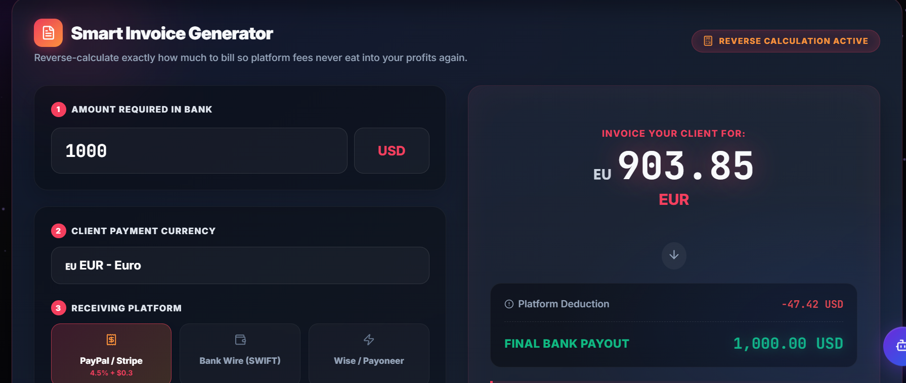
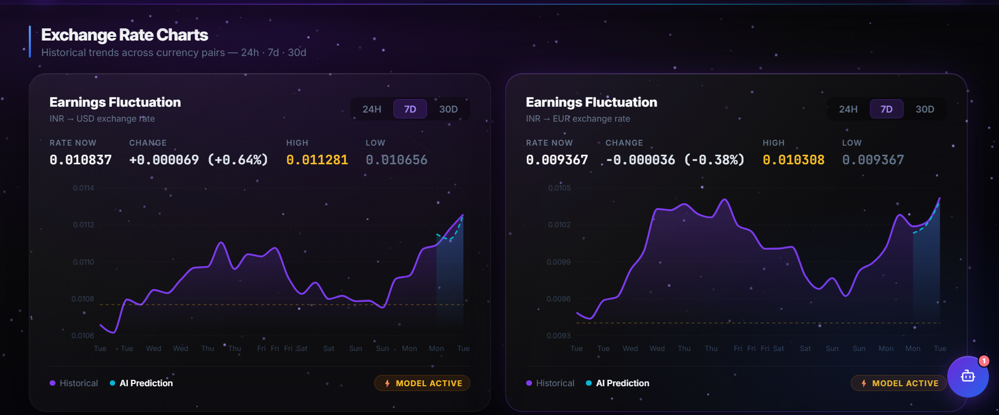

#  FreelanceX – AI Powered Currency Intelligence Platform

FreelanceX is a **currency intelligence platform for freelancers** that helps maximize earnings when working with international clients.

It analyzes global exchange rates and uses **AI-powered arbitrage logic** to determine the **best conversion rate across platforms and currencies**.

> 💡 Earn more by converting currency at the smartest time and route.

---

# 🌍 Problem Freelancers Face

Freelancers working with international clients often lose money because of:

- Poor exchange rates
- Platform conversion fees
- Bad timing during currency fluctuations
- Lack of analytics for currency trends

FreelanceX solves this by providing **real-time analytics, predictions, and simulations.**

---

# ✨ Features

## 📊 Currency Analytics
- Track exchange rate trends
- 24H / 7D / 30D analytics
- AI prediction model

## 💱 Global Currency Converter
- Convert **100+ currencies**
- Real-time exchange rates
- Instant freelancer payout calculation

## 📈 Earnings Fluctuation Tracking
- Understand how exchange rates affect income
- Detect best time to convert payments

## 🧠 AI Arbitrage Engine
The system analyzes multiple currency routes to:

- Find the **maximum real conversion rate**
- Reduce platform fee impact
- Suggest smarter conversion paths

## 📉 Market Trend Monitoring
- Weekly market movement
- High / Low tracking
- Volatility insights

---

# 🖥️ Screenshots

## Dashboard

## Currency Converter

## Analytics

---

# 🛠️ Tech Stack

### Frontend
- React.js
- Tailwind CSS
- Chart Libraries (Recharts / Chart.js)
- Framer Motion

### Backend
- Node.js
- Express.js
- MongoDB

### APIs
- Exchange Rate APIs
- Real-time financial market feeds

---

# ⚙️ How It Works

1️⃣ User selects **source currency and target currency**

2️⃣ FreelanceX fetches **real-time exchange rates**

3️⃣ AI engine analyzes **historical + live market data**

4️⃣ System calculates **best conversion opportunity**

5️⃣ User converts currency at **maximum value**

---

# 🚀 Future Improvements

- AI based **best-time-to-convert alerts**
- Automated **withdrawal recommendations**
- Multi platform fee comparison  
  (PayPal, Payoneer, Wise)
- Personal freelancer earnings dashboard
- Portfolio analytics

---

# 📌 Use Cases

FreelanceX is useful for:

- Freelancers with **USD / EUR / GBP clients**
- Remote developers
- Digital nomads
- Agencies handling international payments

---

# 🤝 Contributing

Contributions are welcome.

1. Fork the repository
2. Create a feature branch
3. Commit your changes
4. Submit a pull request

---

# ⭐ Support

If you like this project, please **give it a star ⭐ on GitHub.**

---

# 👨‍💻 Author

**Nitish Kumar**

Building tools that help developers and freelancers **earn smarter using technology.**